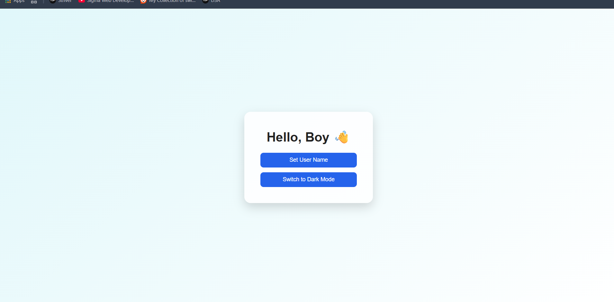
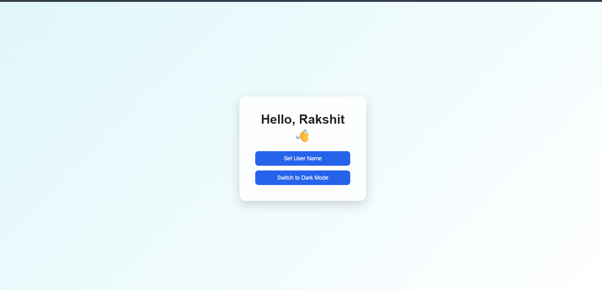
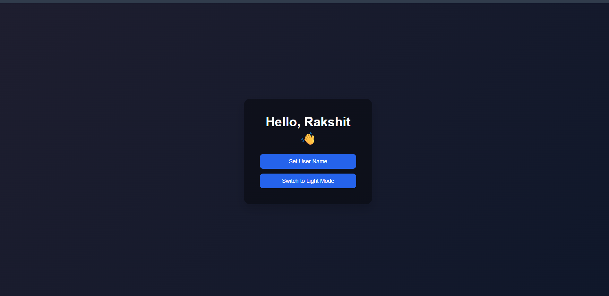

# Experiment 4.1 – Global State Management using React Context API

## Aim

To implement global state management in a Single Page Application using the React Context API.

## Software Requirements

* Node.js
* React (Vite or Create React App)
* Code Editor (VS Code)
* Web Browser

## Theory

In React applications, passing data through multiple components using props can become complex. This problem is known as **prop drilling**. The **Context API** provides a way to share global data such as themes, user information, or settings across components without passing props manually at every level.

The Context API mainly consists of three parts:

1. **createContext()** – Creates a context object.
2. **Provider** – Supplies the global state to components.
3. **useContext()** – Consumes the global state inside components.

This approach makes the code cleaner and easier to manage, especially in medium to large applications.

## Procedure

1. Create a new React application.
2. Create a context file using `createContext()`.
3. Define global states inside a Provider component.
4. Wrap the main application with the Provider.
5. Access the global state inside child components using `useContext()`.

## Implementation Overview

* A global context was created to store:

  * User name
  * Theme (light or dark)
* The `GlobalProvider` supplies this state to the entire app.
* The `App` component consumes the context and:

  * Displays the current user.
  * Allows changing the user name.
  * Toggles between light and dark themes.

## Output

The application displays a centered card showing the user name and buttons to:

* Change the user.
* Switch between light and dark themes.

## Result

Global state was successfully implemented using the React Context API. The application was able to share and update data across components without prop drilling.

