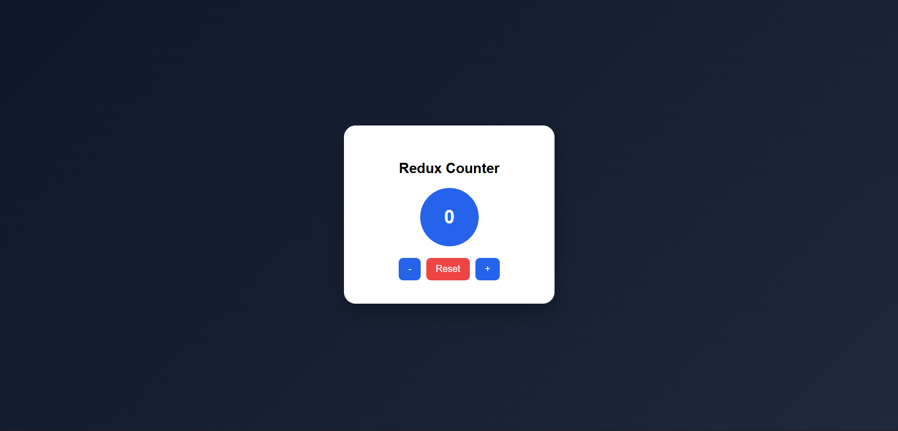
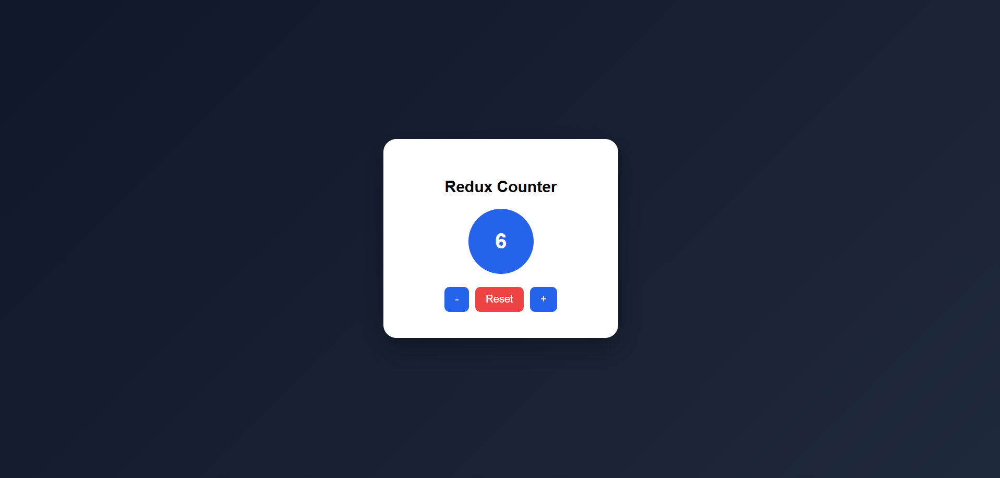

# Experiment 4.2 – State Management using Redux (Counter Application)

## Aim

To implement centralized state management using Redux in a React application.

## Software Requirements

* Node.js
* React
* Redux Toolkit
* Code Editor (VS Code)
* Web Browser

## Theory

Redux is a predictable state container for JavaScript applications. It stores the entire application state in a single global store and updates it using actions and reducers. This approach ensures better state management, especially in large applications.

Redux follows three main principles:

1. **Single Source of Truth**
   The global state of the application is stored in one store.

2. **State is Read-Only**
   The state can only be changed by dispatching actions.

3. **Changes are Made with Pure Functions**
   Reducers are used to update the state based on actions.

Redux Toolkit simplifies Redux implementation by reducing boilerplate code and providing built-in utilities like `createSlice` and `configureStore`.

## Procedure

1. Create a React application.
2. Install Redux Toolkit and React-Redux.
3. Create a Redux store using `configureStore()`.
4. Create a slice using `createSlice()` for counter logic.
5. Wrap the application with the Redux `Provider`.
6. Use `useSelector()` to access state.
7. Use `useDispatch()` to update the state.

## Implementation Overview

* A Redux store was created to manage the counter state.
* A counter slice was defined with:

  * Increment action
  * Decrement action
  * Reset action
* The store was provided to the entire application using the `Provider`.
* The counter value was displayed in a circular UI.
* Buttons were used to update the counter state.

## Output

The application displays a counter in the center of the screen with:

* Increment button
* Decrement button
* Reset button

All state changes are handled through Redux.

## Result

Centralized state management was successfully implemented using Redux Toolkit. The counter application demonstrated state updates using actions and reducers.

