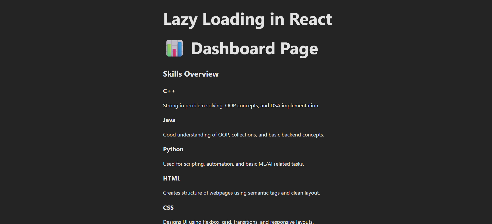

## Experiment 5.1: Component Lazy Loading using React.lazy and Suspense

### Theory

Lazy loading is a performance optimization technique in which components or resources are loaded only when they are needed, instead of loading everything at once during the initial page load. This helps in reducing the initial bundle size and improves the overall loading speed of a web application.

In React, lazy loading is implemented using **React.lazy()** and **Suspense**. The `React.lazy()` function allows components to be imported dynamically using JavaScript’s `import()` syntax. This means the component code is fetched only when it is required, such as when a user navigates to a specific route.

The **Suspense** component is used to wrap lazy-loaded components and display a fallback user interface, such as a loading message or spinner, while the component is being loaded. This ensures a smooth user experience during the loading process.

By using `React.lazy()` and `Suspense`, developers can split the application into smaller chunks, reduce initial load time, and improve performance, especially in large single-page applications.

