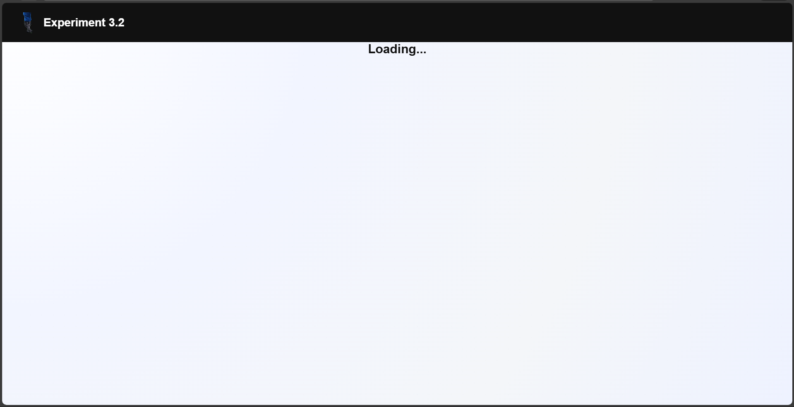

# Experiment 5.2: Lazy Loading in React Routing

## 🎯 Aim
To implement lazy loading in a Single Page Application using React Router and React.lazy().

---

## 🛠️ Software Requirements
- Node.js
- React (Vite)
- React Router DOM
- Web Browser

---

## 📖 Theory
Lazy loading is a performance optimization technique in which components are loaded only when they are required, instead of loading all components at once.  
In React, lazy loading is implemented using `React.lazy()` and `Suspense`. This reduces the initial load time of the application and improves performance.

---

## 🧪 Procedure
1. Create a React application.
2. Install `react-router-dom`.
3. Create multiple components (Profile and Dashboard).
4. Use `React.lazy()` to load components dynamically.
5. Wrap routes inside `Suspense` to show a loading fallback.
6. Test navigation between pages.

---

## 💻 Code Concept
- `React.lazy()` is used to import components dynamically.
- `Suspense` is used to display a loading indicator while the component loads.
- `Routes` and `Route` handle navigation.

---

## ✅ Output
A Single Page Application where the Profile and Dashboard components are loaded lazily, and a loading message appears during navigation.

---

## 🚀 Technologies Used
- React
- React Router DOM
- JavaScript (ES6)
- HTML, CSS

