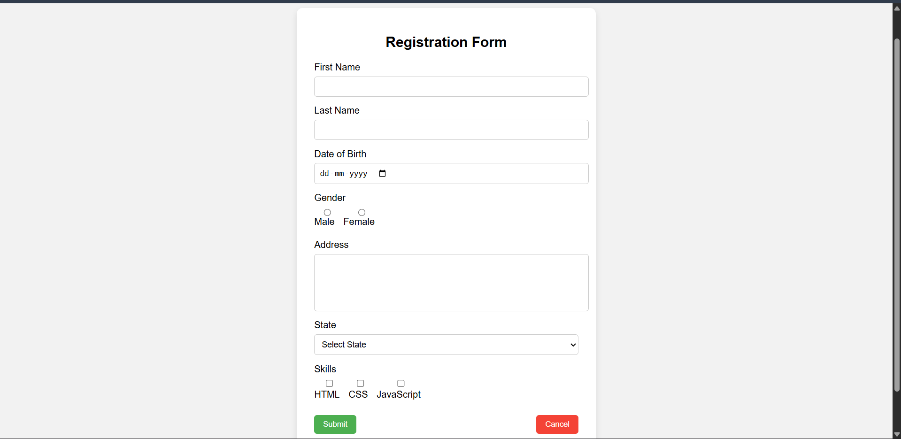
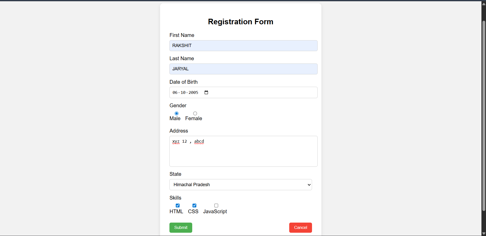
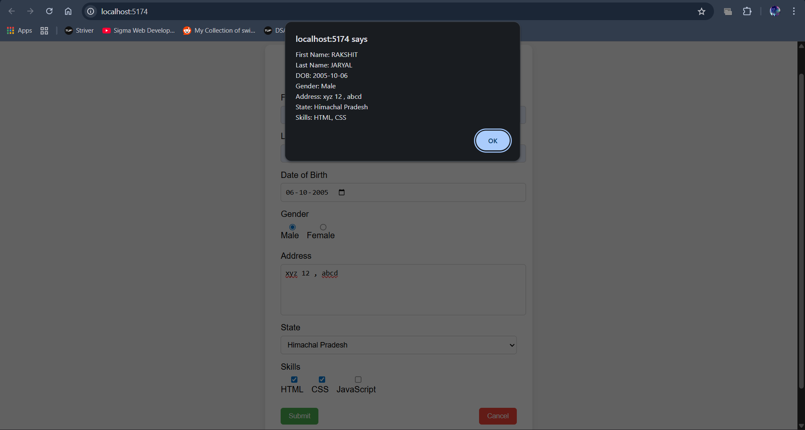

Experiment – 6.1
Handling Forms Using Controlled Components in React
🎯 Aim

To create and handle a form in React using controlled components and display submitted data using an alert box.

🛠 Software Requirements

Node.js

React (Vite / Create React App)

VS Code

Web Browser

📖 Theory

In React, a controlled component is a form element whose value is controlled by React state. Instead of the DOM managing the form data, React uses the useState hook to control and manage input values.

In this experiment, a registration form is created with multiple input fields such as:

First Name

Last Name

Date of Birth

Gender (Radio Buttons)

Address (Textarea)

State (Dropdown)

Skills (Checkboxes)

Each input field is connected to a state variable using useState. Whenever the user enters data, the state is updated through event handlers.

On form submission:

The entered details are displayed in an alert box.

The Cancel button resets all fields to their initial values.

This approach provides better control over form handling, validation, and data processing in React applications.

⚙️ Procedure

Create a React application.

Create a form component with required input fields.

Use useState to manage form data.

Implement handleChange() to update state dynamically.

Implement handleSubmit() to display entered data in an alert.

Implement a Cancel button to reset all fields.

✅ Result

The form successfully handles user input using controlled components. All entered details are displayed in an alert upon submission, and the form can be reset using the Cancel button.

