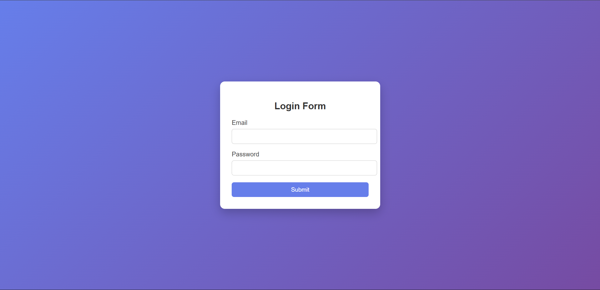
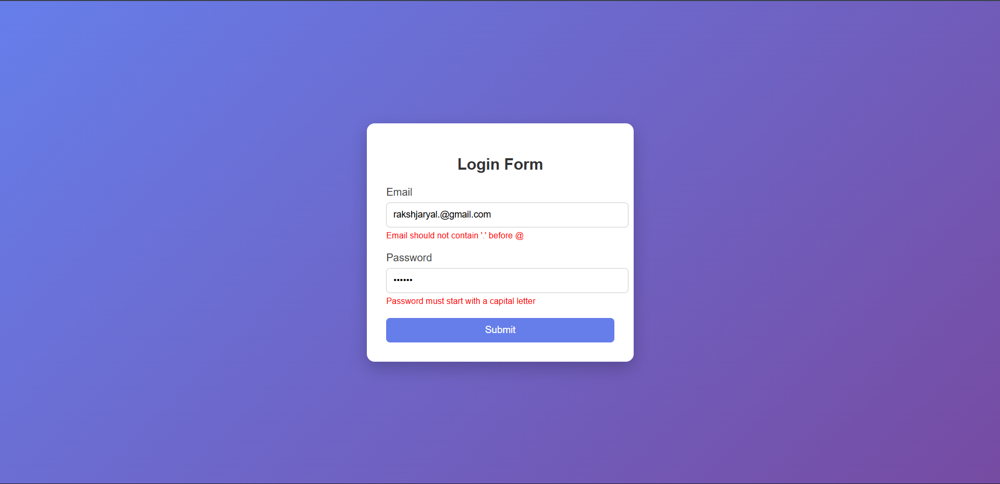
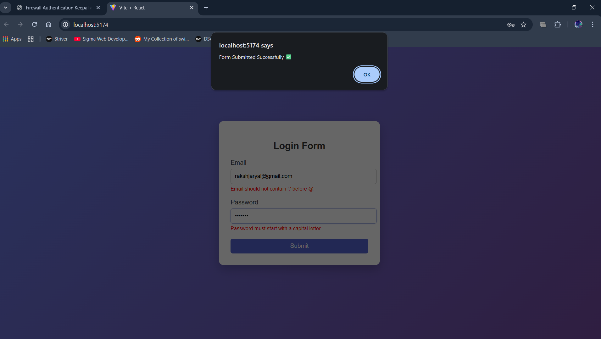

Experiment – 6.2
Client-Side Form Validation Using React
🎯 Aim

To validate form inputs on the client side before submission using React.

🛠 Software Requirements

Node.js

React (Vite / Create React App)

VS Code

Web Browser

📖 Theory

Client-side validation is a technique used to validate user input in the browser before sending data to the server. It ensures that the entered data follows specific rules and constraints, providing immediate feedback without server interaction.

In this experiment, React’s useState hook is used to manage form data and error messages. When the user submits the form, validation conditions are checked for the Email and Password fields.

The email is validated to ensure it:

Contains the @ symbol

Ends with .com, .in, or a valid country code

Does not contain a dot (.) before @

Is not empty

The password is validated to ensure it:

Has at least 5 characters

Starts with a capital letter

Contains at least one number

Contains at least one special character

Is not empty

If any condition is not satisfied, an appropriate error message is displayed and form submission is prevented.

⚙️ Procedure

Create a React application.

Create form inputs for Email and Password.

Use useState to store input values and error messages.

Define validation rules for both fields.

Display error messages if validation fails.

Allow submission only when all conditions are satisfied.

✅ Result

The form successfully validates user inputs on the client side. It displays error messages for invalid inputs and allows submission only when all validation conditions are fulfilled.

