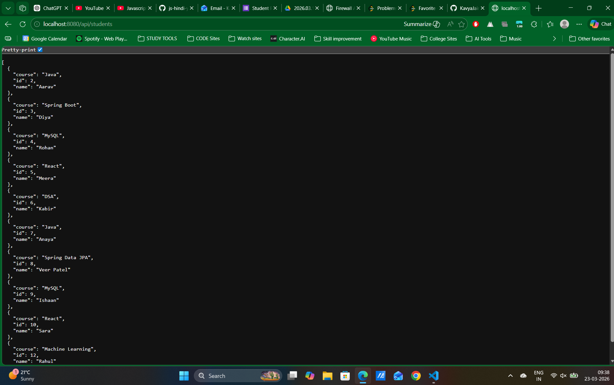
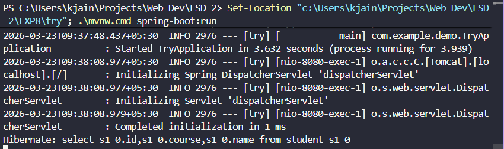

# EXP 8 - Student Management REST API

This project is a Spring Boot backend application used to manage student records with CRUD operations using MySQL and Spring Data JPA.

## API Base URL
`http://localhost:8080/api/students`

## Endpoints

- `GET /api/students` - Get all students  
- `GET /api/students/{id}` - Get one student by ID  
- `POST /api/students` - Create a new student  
- `PUT /api/students/{id}` - Update an existing student  
- `DELETE /api/students/{id}` - Delete a student  

## Database Setup (MySQL)

1. Create database:

```sql
CREATE DATABASE spring_hibernate_db;
```

2. Open `try/src/main/resources/application.properties` and set your MySQL username/password if needed.

## Run the Project

From the **try** folder:

### Windows
```
mvnw.cmd spring-boot:run
```

### macOS/Linux
```
./mvnw spring-boot:run
```

The application will run at:

`http://localhost:8080`




